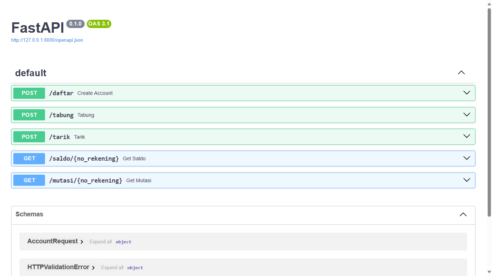

# Mini API for CRUD Bank Account Bank
## Built by : @AndiAlifs



# Project Structure
```bash
├── main.py                 # Main File, consist of FastAPI App and Logic
├── requirements.txt        # Requirements Package
├── README.md               # This File
├── Database/               # Database Folder
├── ├── database.py         # Database Connection and Model
├── ├── schemas.py          # Pydantic Schema
├── ├── docker-compose.yml  # Docker Compose File for Postgres and PgAdmin
```

# Requirements
- Python 3.6^
- FastAPI
- Uvicorn
- Docker
- - Docker Compose
- - Postgres Docker Image
- - PgAdmin Docker Image
- Postman (Optional)

# How to Prepare
1. Download and Install Python 3.6^
2. Install Requirements Package
```bash
pip install -r requirements.txt
```
3. Install Docker
4. Install Docker Compose
5. Pull Postgres Docker Image
```bash
docker pull postgres
```
6. Pull PgAdmin Docker Image
```bash
docker pull dpage/pgadmin4
```

# How to Run
1. Run docker-compose
```bash
cd Database
docker-compose up -d
cd ..
```
2. Create Database
    - Open PgAdmin on ```http://localhost:5050```
    - Login with email ```admin@admin.com``` and password ```admin```
    - Create Database with name "sanberhub_pyjun"
3. Run Uvicorn
```bash
uvicorn main:app --reload
```
4. Open API Docs on ```http://localhost:8000/docs```
5. Enjoy, you can try to test the API with Postman
